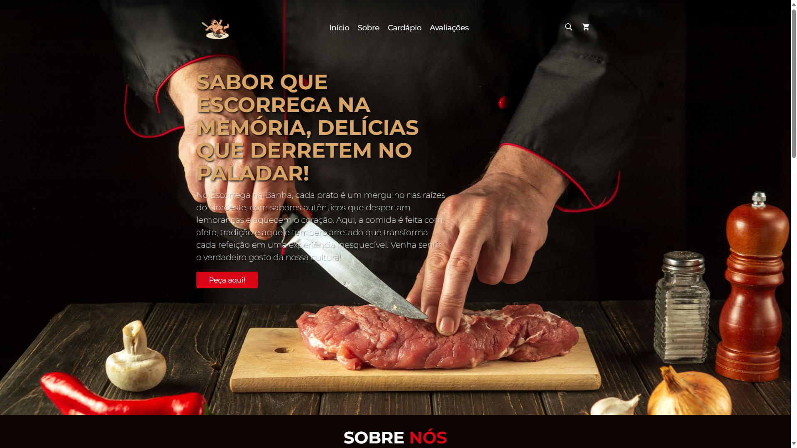
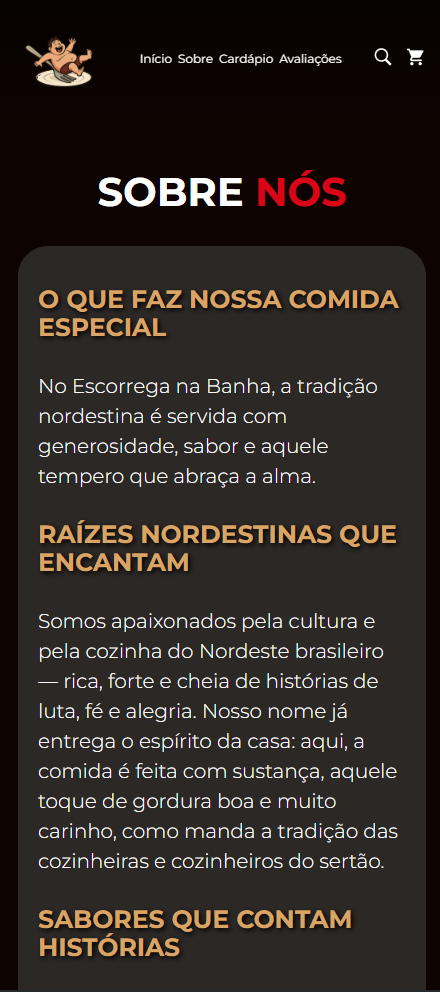

# Projeto de Programação para Web 1 - [Site para restaurante - 🧈 EscorregaNaBanha]

**EscorregaNaBanha** é um projeto de site para restaurante, desenvolvido como parte do curso de Engenharia de Software. O objetivo é apresentar um cardápio digital e fornecer uma experiência simples, intuitiva e acessível para os clientes.

## 🛠️ Tecnologias Utilizadas

- **Python** (Flask) – Back-end leve e rápido para gerenciar rotas e lógica do sistema.
- **HTML5** – Estrutura das páginas.
- **CSS3** – Estilização das interfaces.
- **Jinja2** – Template engine para renderizar conteúdo dinâmico.

## 📌 Funcionalidades

- Página inicial com informações do restaurante.
- Menu com os pratos disponíveis.
- Página de contato com informações de endereço e telefone.
- Navegação simples entre as páginas.
- Estrutura pronta para adicionar funcionalidades futuras como pedidos online, login de usuário, etc.

## 🚀 Como executar o projeto

1. Clone o repositório:
    ```bash
   git clone https://github.com/MatheusMachado16/EscorregaNaBanha.git
2. Acesse a pasta do projeto:
    ```bash
    cd EscorregaNaBanha
3. Crie e ative um ambiente virtual (opcional, mas recomendado):
    ```bash
    python -m venv venv
    source venv/bin/activate  # No Windows: venv\Scripts\activate
4. Instale as dependências:
    ```bash
    pip install -r requirements.txt
5. Execute a aplicação:
    ```bash
    flask run
6. Acesse no navegador:
    ```cpp
    http://127.0.0.1:5000/
## 🖼️ Capturas de Tela
<!-- Coloque aqui imagens do site rodando, se possível -->






## 👨‍💻 Equipe

[@odilon007](https://github.com/odilon007)

[@MatheusMachado16](https://github.com/MatheusMachado16)

[@omarhenriqu3](https://github.com/omarhenriqu3)


